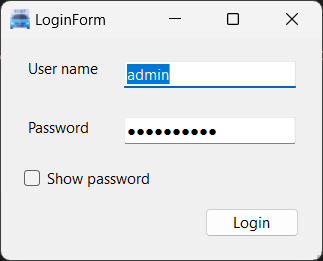
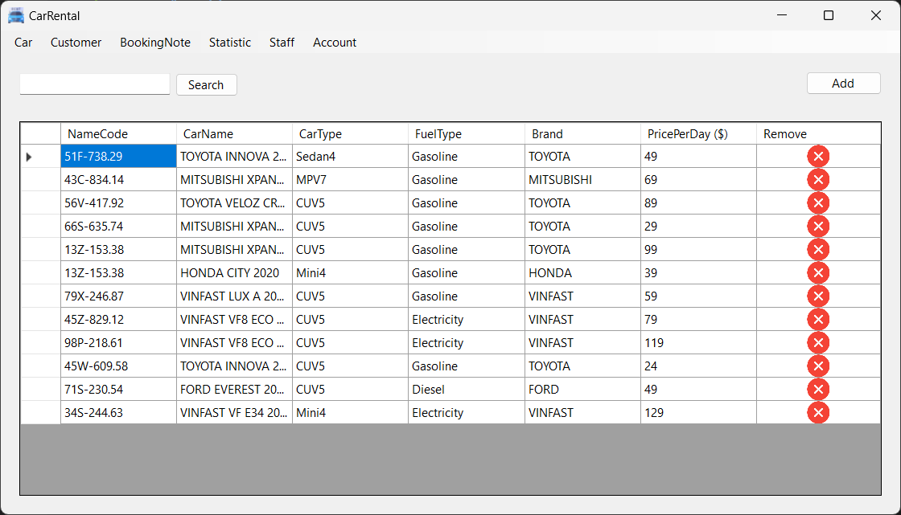
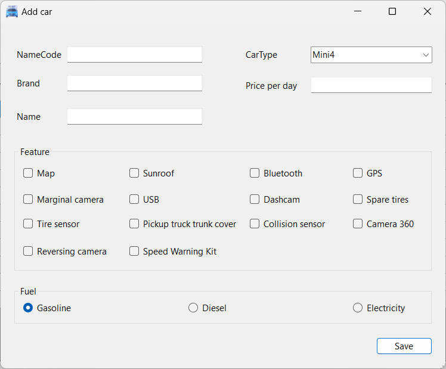
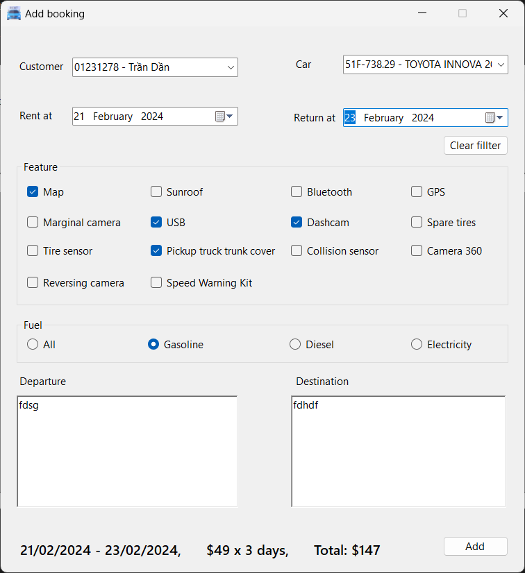
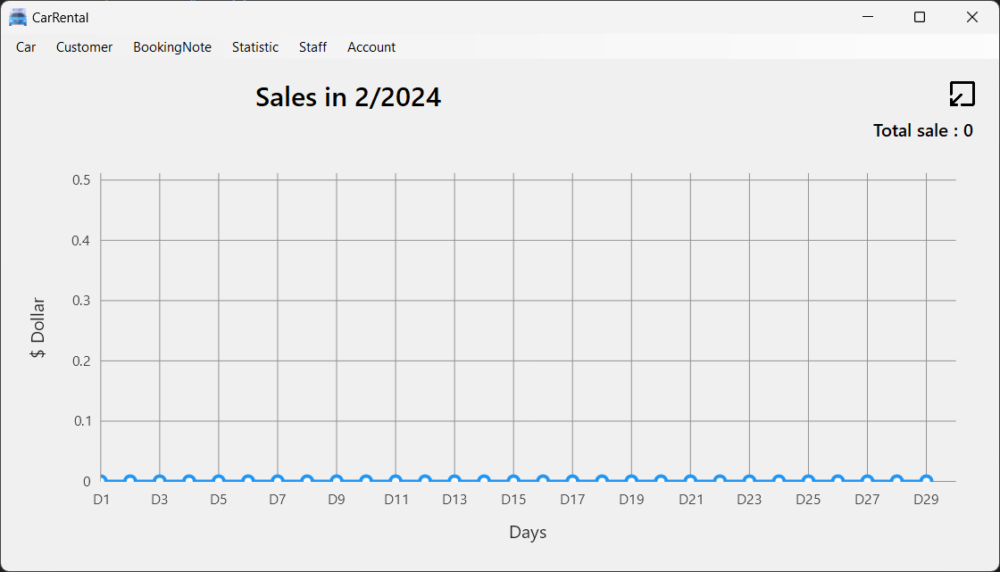

<!--title-->

# CarRental  

<!--/title-->

Midterm Project for .NET Technology  

## Preview  

### 1. Login  
  

### 2. Car List  
  

### 3. Create a New Car  
  

### 4. Create an Order  
    

### 5. Statistics  

> I accidentally deleted the sample data, please download it and add it back. :3

  

*PreviewImages for more...*  

## Project  

### 1. Problem Statement   

(Available in the "doc" folder)

### 2. Project Structure  

#### 2.1 Entities  

Contains the entity objects to be managed  

#### 2.2 Exceptions  
Contains custom exceptions for handling errors  

#### 2.3 Forms  
Contains forms for modifying data  

#### 2.4 Helper  
Contains utility/helper classes  

#### 2.5 AppSetting.cs  

Contain setting class for this application

# How to Run the Code  

1. Open the `CarRental.sln` file  
2. Update the `ConnectionString`  
3. Import sample data from the `rentalCar.sql` file (if needed)  
4. Click the "Run" button :3  

# Demo  

Demo video link: [Link to demo video](https://drive.google.com/file/d/1rL4p9SZfrcRLiDWL5ugG018qMnZMYFXr/view?usp=sharing)  
