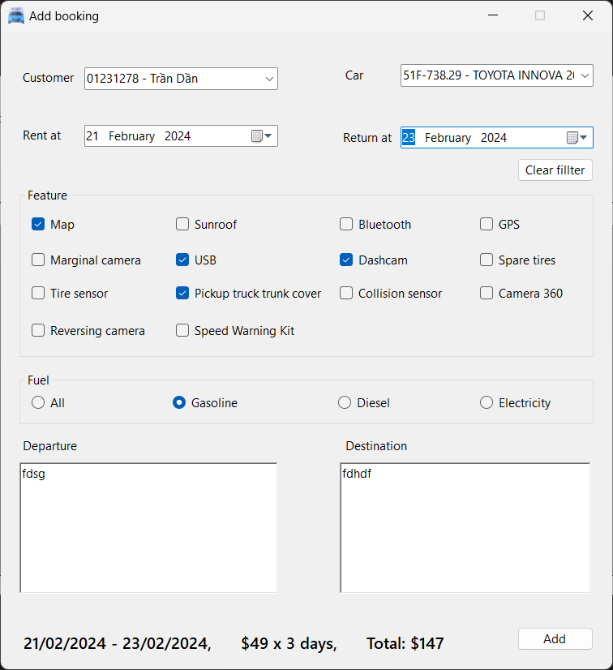

<!--title-->

# Hệ Thống Quản Lý Thuê Xe: Từ Đặt Chỗ Đến Trả Xe

<!--/title-->

Đồ án giữa kỳ môn Công nghệ .NET. Một hệ thống quản lý thuê xe toàn diện được xây dựng bằng C# và WinForms, hỗ trợ quy trình đặt xe, trả xe và quản lý khách hàng.

## Xem trước

### Đăng nhập
  

### Danh sách xe
  

### Thêm xe mới
  

### Tạo đơn thuê
    

### Thống kê

> Mình lỡ xóa dữ liệu mẫu, vui lòng tải về và nhập lại nhé. :3

  

*Xem thêm trong thư mục PreviewImages...*  

## Dự án

### Đề bài

(Có trong thư mục "doc")

### Cấu trúc dự án

#### Entities  
Chứa các đối tượng thực thể cần quản lý  

#### Exceptions  
Chứa các ngoại lệ tự định nghĩa để xử lý lỗi  

#### Forms  
Chứa các form để thao tác dữ liệu  

#### Helper  
Chứa các lớp tiện ích/hỗ trợ  

#### AppSetting.cs  
Chứa lớp thiết lập cho ứng dụng này  

## Cách chạy mã nguồn  

1. Mở file `CarRental.sln`  
2. Cập nhật `ConnectionString`  
3. Nhập dữ liệu mẫu từ file `rentalCar.sql` (nếu cần)  
4. Nhấn nút "Run" :3  

## Demo  

Link video demo: [Xem video demo](https://drive.google.com/file/d/1rL4p9SZfrcRLiDWL5ugG018qMnZMYFXr/view?usp=sharing)  
